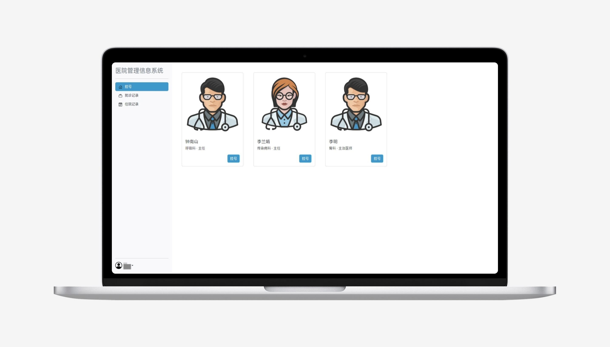
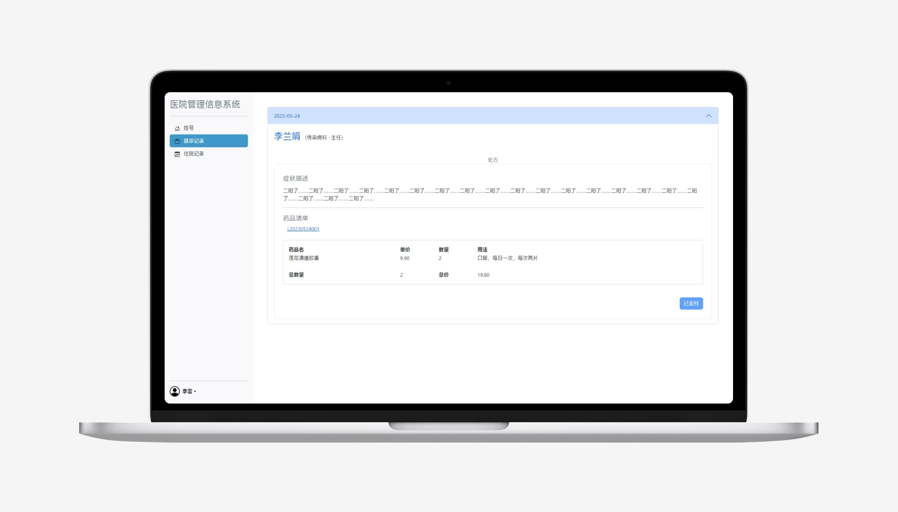
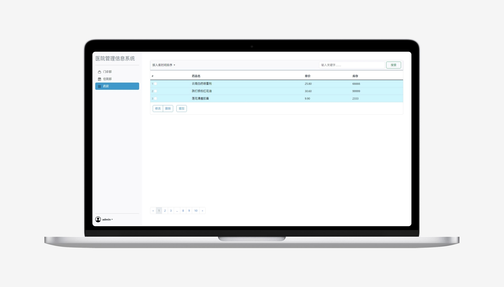
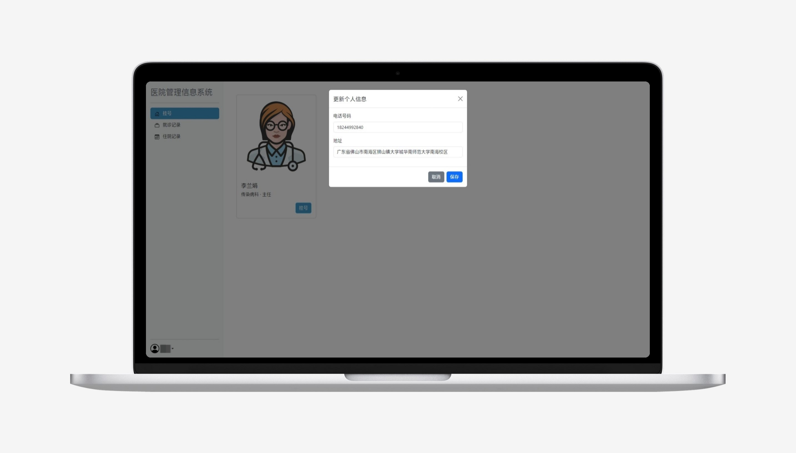
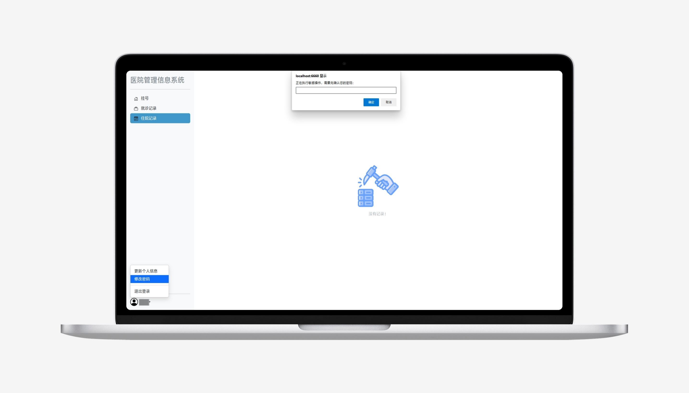

# HospitalInformationManagement
一个十分简易的医院信息管理系统

（关键词）***服务端渲染 模板引擎***

## 有啥功能🧐
根据[数据库设计](https://github.com/PeerlessMonster/HospitalInformationManagement/blob/master/README_ATTACH/database-design_zh-CN.pdf)、hospital.sql示例数据，实现原型系统，仅展示效果

以下为功能需求分析：
 - 账户管理
> - 患者注册信息录入
> - 患者/医生/管理员登录及权限验证
> - 患者/医生/管理员密码重设
 - 部门及科室管理
> - 管理员维护科室的基本信息
> - 管理员维护医生的基本信息
> - 系统调控医生排班
> - 医生查询自己的排班
> - 系统统计不同科室的排班情况
> - 管理员维护病房、床位的基本信息
> - 系统统计不同医生的工作量情况
 - 就诊管理
> - 医生查询接诊患者
> - 医生为患者开具处方
> - 患者查询就诊记录
 - 药品管理
> - 管理员维护药品的基本信息
> - 系统监控药品库存
 - 计费管理
> - 系统计算就诊总费用
> - 系统计算住院预缴纳费用
 - 住院管理
> - 医生填写该患者的住院记录
> - 患者查询住院记录
> - 系统统计病人的治疗情况

## 先看东西🤩
### 运行截图

## 大感谢🫡
### 依赖
- 组件库：[Bootstrap](https://getbootstrap.com/) v5
- 框架：[Gin](https://gin-gonic.com/)
- ORM：[GORM](https://gorm.io/)
- 数据库：[MySQL](https://www.mysql.com/) 8.0

无商业用途！仅用作学习Web开发，编写代码最终展示效果