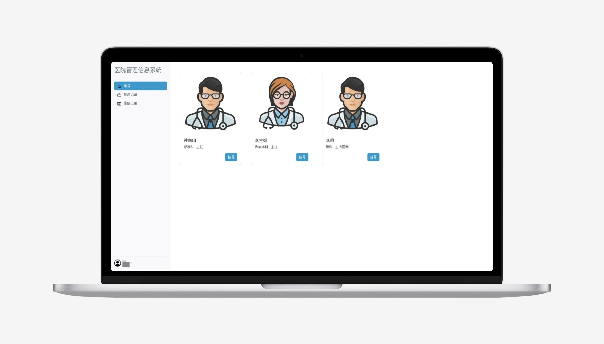
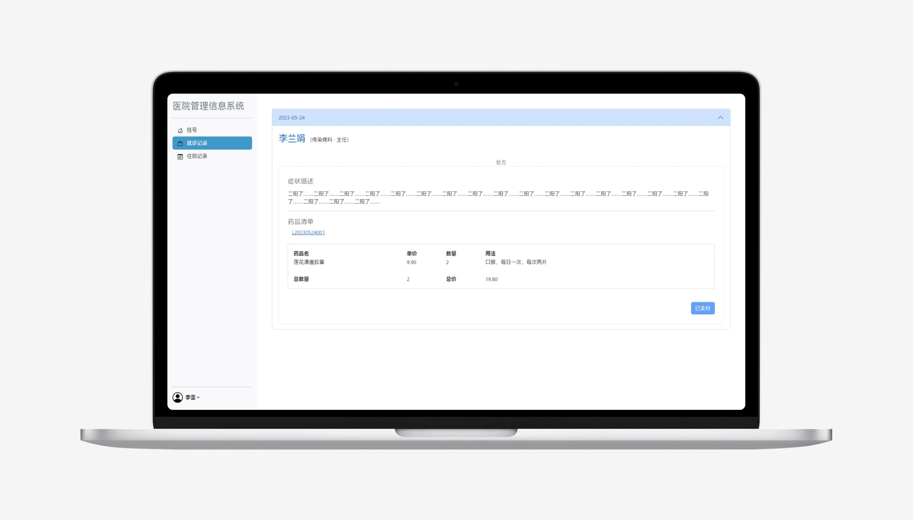
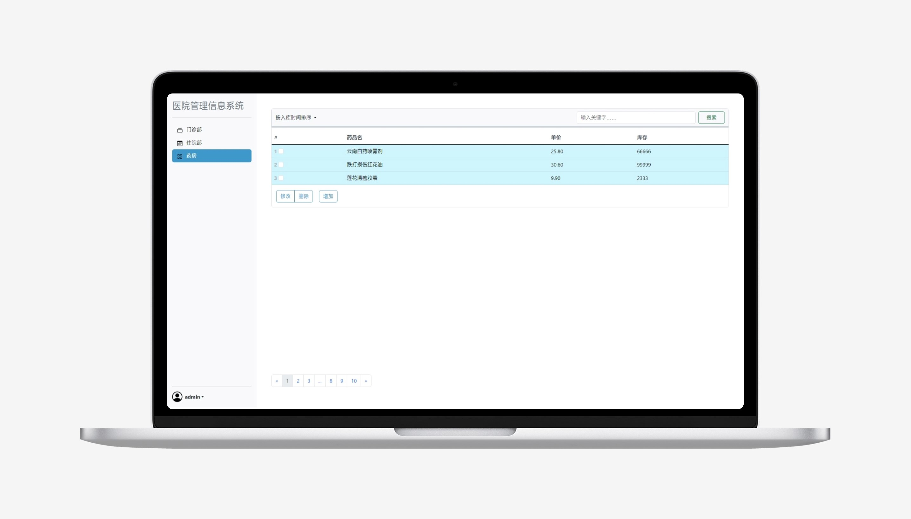
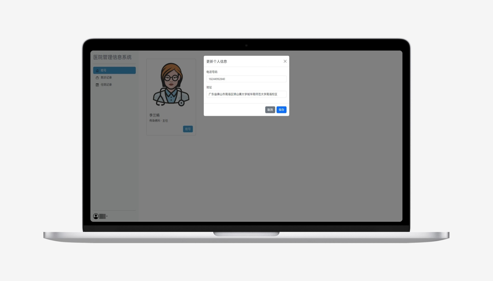
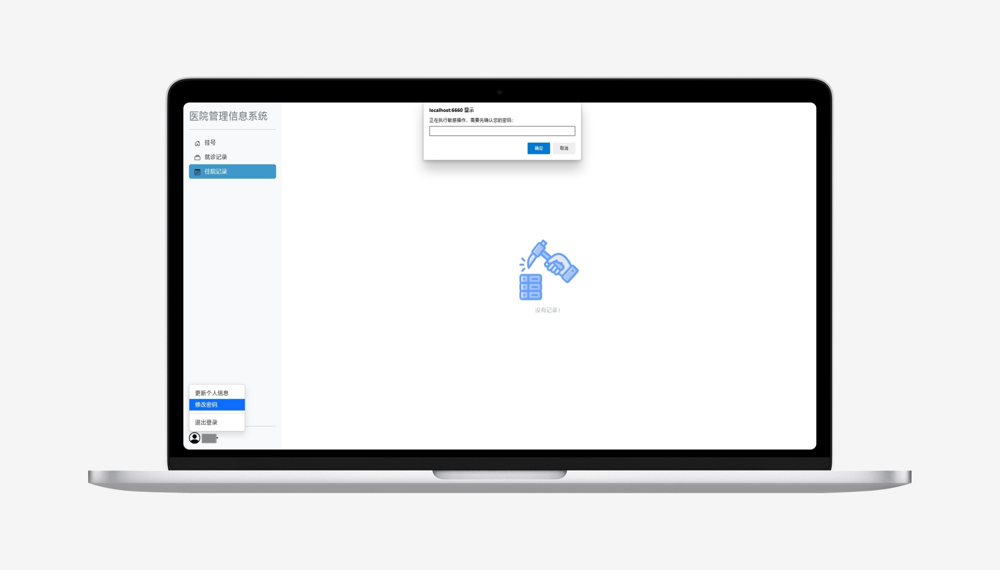

# HospitalInformationManagement
一个十分简易的医院信息管理系统

根据[数据库设计](https://github.com/PeerlessMonster/HospitalInformationManagement/blob/master/README_ATTACH/database-design_zh-CN.pdf)，实现原型系统，无具体功能仅展示效果

（关键词）***服务端渲染 模板引擎***

## 先看东西🤩
### 运行截图

## 大感谢🫡
### 依赖
- 组件库：[Bootstrap](https://getbootstrap.com/) v5
- 框架：[Gin](https://gin-gonic.com/)
- ORM：[GORM]()
- 数据库：[MySQL](https://www.mysql.com/) 8.0

无商业用途！仅用作学习Web开发，编写代码最终展示效果